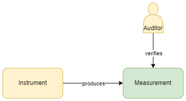
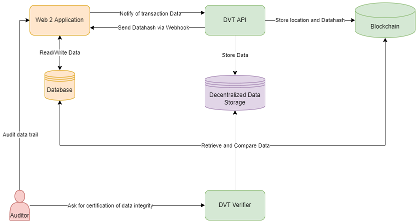
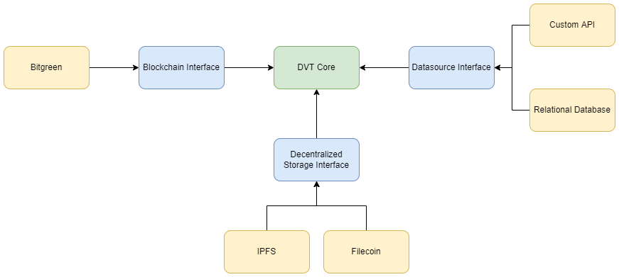
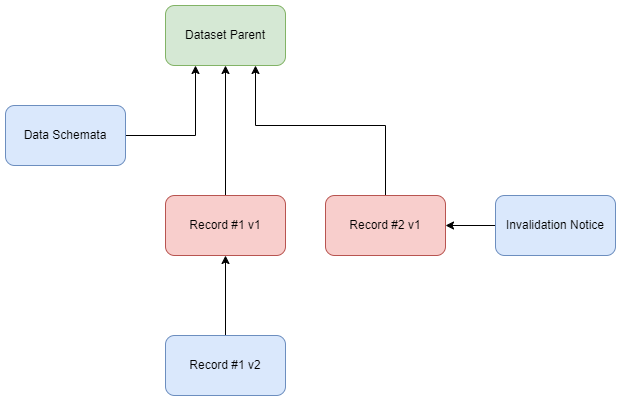
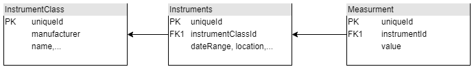
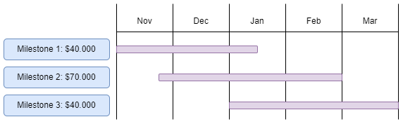

# Datasource Verification Tool Framework

## Executive Summary

The following document outlines our proposal for an open-sourced data source verification tool framework utilizing both a blockchain and a decentralized data storage mechanism to meet the growing demand for traceability for real-world sustainability challenges. Specifically, in the past decade data collection and verification has gained notable attention in international commodity supply chains and carbon credit applications where accurate data is crucial to maintaining transparency and trust among suppliers, consumers and partners alike. Particularly in commodity supply chains sourcing from emerging economies, such as cocoa and palm oil, there is an unprecedented need for verifiable data that passes along a multitude of actors in the supply chains. End-consumers demand proof for claims of sustainability and traceability and key regulators such as the EU are introducing new legislation requiring traceability for the import of key commodities.

Our solution would offer the framework for unparalleled transparency, immutability and security. Moreover, it already has both a web2 supply-chain traceability partner and a pilot client focused on sustainable cocoa.

The proposal below is designed as delivering on three milestones:

1. Partner alignment on overall **product and integration roadmap**.
2. Core logic of a **Datasource verification tool**.
3. Integrations with the blockchain, datasource and storage components - delivery of a **fully-functioning tool and framework** for web3-enabled datasource verification.

As per the Request for Proposal, our proposal provides an overall scope of work, sequential milestones, timelines for development and delivery, and funding requested to facilitate each stage. We welcome your feedback and look forward to working with Filecoin Green on this worthwhile and much-needed initiative.

We also elaborate the proposed pilot project and her partners at the end of this proposal. If successful, we see many opportunities in the market for similar partnership replications and scaling of this framework.

## Scope of Work

This document describes a technical solution to verify data that is supposed to be immutable or transactional with the help of a blockchain based datastore redundancy system. The described solution will verify that data in a traditional database or API was not changed. This is done by adding minimal additional development to already existing systems. Data is duplicated in a transactional way and a duplicate is stored. In case of data loss, the duplicate serves as a source for data recovery. A practical example of immutable, transactional data are a set of consecutive measurements like this:



Two entities - an **instrument** and an **auditor** - create a **data record** together, which is a measurement in the above example First the instrument automatically produces and submits data, such as a measurement, on its behalf. An auditor verifies that the data the instrument produced is sound and sets their stamp of approval. In this process the production and the affirmation of data accuracy can each be modeled as a transaction. In a system with many data records each one can be reproduced by reapplying all transactions to the datastore. The solution presented here stores all transactions both on a blockchain and decentralized data storage site, while providing a user-intuitive framework to add this functionality to web2 solutions with minimal efforts.

Additionally, data hashes will be created with configurable rules so that data integrity can be proven for auditors. This is useful as blockchains and decentralized data storage sites, though immutable and temper proof, are not the most versatile. This is largely due to latency constraints and the way data itself is structured, whereas traditional relational databases are much more performance optimized. This framework allows non-blockchain developers to integrate a verifiable trust layer without the need to delve into blockchain development on their own.

With increasing demand for verifiable traceability in supply chains and auditing mechanisms, the following design for a Datasource Verification Tool (DVT) offers a framework for ensuring true temper proof and immutable record-keeping.

Over the course of this document we will assume that a traditional relational database is employed as the datasource to enhance. However, the concept itself is valid for any type of datasource and can be adopted via a connector interface. The blockchain layer utilized here is Bitgreen - an impact-focused layer-1 blockchain built in the Polkadot ecosystem. Of course, another blockchain with matching capabilities could be substituted, just as long as an interface connector can be implemented.

## Architecture of the DVT



This general structure and workflow depicts the high level components of the system outlined in this document. For any existing system four new components are added to the stack while only the two DVT components require maintenance.

Generally the DVT API will handle most of the hashing, storing and indexing of the redundant dataset, while the DVT Verifier provides an alternative view on a dataset. The existing system and the DVT API communicate via webhooks, asynchronous http calls or the DVT API can even directly be connected to a datasource and act on any signals or time based.

### Auditors

An auditor in the context of this document is a person or algorithm that validates if the history and integrity of a dataset is sound. In the context of milestone one, the auditor role will be fulfilled by any third-party contracted by the client/end-user of the DVT mechanism. For example, in the case of a project intending to originate and distribute carbon credit, the auditor would be a properly accredited third-party firm would access the DVT to perform needed verification audits.

### DVT Core



The **core** of the Data Verification Tool is a modular framework that can connect different data sources and target storages together. Existing systems have vastly different stacks which can be funneled through standardized interfaces that allow for freedom. The DVT Core in the center takes processed standardized data and manages the communication between all interfaces and provides the general workflow.

The DVT Core ideally should not be customized but be developed as a strong open source management layer that can handle the use-cases described in this document for all datasets. It is important that users who will adopt the system are not forced to re-write their custom adapters. The DVT application must be designed carefully with maintenance on these custom applications in mind. After the initial beta period, the DVT core and interfaces will be stable enough to not require adaptive changes from users. Flexibility, modularity and a clearly designed mandate are key.

### Blockchain

The blockchain provides means to verifiably reconstruct the state of the dataset. An acyclic directed graph is spanned up through the transaction history with a dataset parent being the end of every path. Every record can have multiple versions that refer to each other (the latest version always refers to its predecessor).

Records can be invalidated or amended, while additional custom metadata could be attached to provide context for audit or other processes.



The blockchain will store a record for each transactional change done to the dataset. It will hold a reference to the new and previous data locations on the decentralized storage as well as the data hash results for verification.

While most late-generation blockchain should suffice in providing this basic service, Bitgreen elected to utilize the Substrate SDK and launch it as a parachain in Polkadot's ecosystem. The Polkadot ecosystem offers unparalleled security and interoperability by design, and Substrate's framework offers a future-proof method to upgrade blockchains through pallets without the need for hard forks. As part of the ecosystem's network of purpose-built parachains, Bitgreen serves as the impact and sustainability hub, and this initiative is one of a diverse set of initiatives and DApps to realize the project's mission of facilitating $1T into impact projects within ten years.

### DVT Verifier

The **DVT verifier** is a simple application that gives an **Auditor** an interface to verify a dataset, and automatically generates warnings in cases where data points fail tomatch. Based on configuration there could be multiple levels of warnings as there will always be some mutable fields (see below).

The DVT Verifier application must be an open source, non-web based application. The version of the application must be fixed and accepted by the Auditor to prevent the DVT Verifier itself from colluding in an attempt to forge data. The tool only serves its intended purpose if the auditor can make sure that the data pulled from all data sources is done so in the predefined manner.

The data for an auditor should be a comprehensive report of the datasets changes.The DVT verifierflags records following predefined rules, such as immutable fields changing over time, invalidated or amended data. It will be able to show a complete history for every single record so auditors can track down any anomalies.

The reports should come in two formats:

Human readable: A PDF/HTML or other printable document type

JSON: A computer readable format for automatic anomaly detection, statistics and input to monitoring tools.

### Decentralized Data Storage

**Encryption**

While not all data stored is to be accessible to everyone, decentralized data storages like IPFS are open systems. Therefore data should be encrypted in several layers of asymmetric and symmetric encryption before being added to decentralized storage. The DVT API needs to hold public keys in order to encrypt the data, while the DVT Verifier can decrypt the data on the users own machine without touching online servers and therefore minimizing risk of being compromised.

In case of compromised state the data on the public data storage has to be deleted and the transaction chain on the blockchain has to be rebuilt and references in the datastore updated. This can be fully automated and will not happen in most production environments.

Should the decryption keys get lost, data integrity can still be verified as long as the public key used for the encryption is not lost by encrypting the source data. Comparing it with the redundancy layer and achieving a match would recreate a new transactional record on the blockchain and database, removing the old record. Should data have been forged in this case it is not knowable what exactly has been tempered — only that records do not match.

**No Store**  **Data Fields**

No store data fields might be very confidential data fields in a record or fields that are not relevant for integrity. A good example of these are user emails and passwords. These are essentially recoverable on the application layer by a user repopulating these fields on data loss. The fields are also mutable and therefore cannot be used for the integrity hashing algorithms as they change over time and lead to different results.

Fields like this do not add any value to traceability or integrity of a dataset and can therefore be omitted.

**Mutable Data**

Data records are mostly stored in relational databases. In order to verify and hash data fully some relations might have to be resolved. For example a data record produced by an Instrument providing measurement data might look like this:



The instrument itself belongs to a class of instruments. A real life example could be the measurement of precipitation in an area. In this case, the instrument could be a precipitation sensor. There may be many precipitation sensors on a given field and each measurement belongs to a single instrument, while a certain instrument could measure several different phenomena at the same time.

The instrument has a lifetime. It started measuring at a certain time but might be decommissioned at some point. If the redundantly stored data record resolves these foreign keys then this mutable data field must be excluded from the hashing algorithm. **A foreign key must not change on a data record**.

A problematic example of a changing datafield would be an instrument's confidence level, a field that should not be mutable. Measurements would be assumed with a certain level of confidence for a time and decisions might have been made taking these into account. If the confidence level changes in an instrument's record it automatically takes effect for ALL measurements that are done by the instrument and an auditor would never notice it changed over time. If the measurement records are hashed and copied as is without resolving the foreign key relation the DVT would also not catch this. **Therefore the DVT must resolve foreign key relationships and blow up the data.** This means storage capacity might be higher by a magnitude on the redundancy layer compared to a relational database. Since the DVT is designed as a verification tool and not a fast access data viewer this is not a problem.

**Data Recovery Interface**

If all changes that are made to a Database are recorded in a transactional manner and all no-store fields are non essential can be easily recovered otherwise (like passwords/email-addresses of system users), the whole datastore can be recovered via the DVT. This creates an additional layer of security against potential data loss or corruption that could potentially happen even on redundant database setups. Corruption or falsely inserted data can be invalidated that could be indexed by defective instruments or similar can also be easily detected.

**Data Invalidation and updating**

Data is not necessarily always final and correct. If data records are invalidated or amended iteratively, a history of the changes should be available in the recording tools. The transactional nature of the DVT data storage allows it to span up a graph around changes and make them visible to auditors. Auditors will have a clear report on certain aspects of a dataset in order to validate if changes were made in good faith and detect any possibilities of malicious manipulation.

**Storage Schemata**

With the above considerations in mind, it is required that the data stored has schemata. These schemata might change over time. For example a data table could get a new field. Most of the time no value will be added to pre existing records. However any new field changes the hashing algorithms output. Therefore a history has to be kept where records are hashed with which schema version for reference. The schemata itself need to be stored on decentralized storage as well.

Schemas should be implemented as JSON configs having the following but not limited to parameters:

Fields to hash

Resolve or not resolve foreign keys (Default resolve)

Mutable fields

Immutable fields (default)

no store fields

Table joins to get exploded data for all necessary records (Specific to Relational Database Adapter)

### Changing field names in source

Oftentimes fields are renamed in data storages to have a more fitting and descriptive name or for consistency with other fields. This creates a problem since the Data hashes are done over a JSON data format. Changing a name on a field will change the hashing algorithms result. This means the schemas need a mapping field.

```
{ "tableName": "Instrument", "version": "2", "mapping": [{ "name": "uniqueId", "fieldType": "privateKey", "valueType": "long" }, { "name": "serialNumber", "sourceName": "newNameInSourceTable", "fieldType": "immutable", "valueType": "string" }, ...] }
```

**Technologies**

For the API, Core and Interface development several different programming languages would be eligible. Java and C# both have powerful API web frameworks as well as good support for modularization to exchange custom adapters with simple configs and drop-in packages without changing the core open source application code. However both of these have rather limited support in the web3 space. While java has a usable port of web3js it is lackluster compared to the original libraries. The same is true for most blockchain ecosystems.

Javascript and Python in general have the most support. The Core API needs to run at least on Linux systems. The Verifier application must run on Windows and Mac. Therefore a cross-platform compatible language is required. In recent years Javascript became a widely used full stack development language which allows to implement standalone desktop applications that are not limited to browser/HTML applications.

Since most libraries on the web3 side are natively implemented in Javascript this allows the use of a single programming language for all pieces of the software without reimplementing complex cryptographic libraries. While the backend infrastructure will be implemented as nodeJS server infrastructure the verifier will be implemented using electronJS, a framework getting increased popularity that is already used to implement the Slack desktop chat application.

## Milestones

### Milestone 1: Partner alignment on overall product and integration roadmap.

**Work with key partners**

With the implementationpartner and initial client both identified for a pilot project, the scope and implementation requirements for each participating party will first have to be closely coordinated.

**Architecture improvement and specification documents**

The architecture outlined in this document is a good initial draft but may be updated upon further research. A clear specifications document is required to make sure all minute caveats are addressed during implementation

**Schema Specification**

The initial version of the DVT schema version must be defined according to available test data and best JSON best practices.

**Problem Statement for future solving**

Analysis and specification of further problems that come up doing full architectural design, not in scope of the first iteration, will be addressed.

> Deliverables: A coherent technical roadmap that has achieved full alignment between all stakeholders, with robust airing out of any potential outstanding challenges that could only be addressed during build. Furthermore, a clear estimate of timeline and team resources to be allocated to the build will be set out and executed upon.

### Milestone 2: Core logic of a Datasource verification tool

**Implement DVT Core and Interfaces**

This phase focuses on the core logic of data processing based on the schemas in the DVT Core.

**Mock adapters and Test data**

Before full implementation of adapters, the interfaces shall be mocked with test data to ease development without connections to the individual data storages. This will help a faster development cycle where test data can be easily rebuilt and restructured as well as interfaces changed much faster without coordination overhead between different developers.

> Deliverables: A built-out Data Verification Tool and accompanying interface, ready for implementation following results from dummy-data testing.

### Milestone 3: fully-functioning tool and framework for web3-enabled datasource verification.

**Blockchain Adapter**

The first blockchain of choice is Bitgreen, a substrate based layer 1 blockchain in the polkadot ecosystem. The adapter can be easily adopted for other substrate based chains.

**Datasource Adapter**

The data source adapter is either a direct database connection to a relational database or a custom API + Webhook infrastructure based on partners' needs.

**Storage Adapter**

The first adapter for decentralized storage will use Filecoin and its open source libraries.

**DVT Verifier implementation**

The DVT Verifier shall be implemented as a electron.js standalone application

> Deliverables: A battle-ready data verification tool framework, ready for integration with any appropriate blockchain, datasource and data storage solution.

**Budget/timeline**



### Pilot Project Partnership

The initial partnership in which we would like to test and develop this proposition is with Bitgreen, Meridia and Belterra.

In this partnership:

- **Bitgreen** will take the role of **technical lead (1)** managing the overall project execution and (2) executing on the design, build and delivery of the DVT framework.
- **Meridia** will take the role of **technical partner** executing (1) the notification of transaction data to DVT API and (2) providing the API for retrieval and comparison of data for DVT verifier to access.
- **Belterra** will take the role of **client & design partner,** providing case-specific requirements and insights for a successful pilot project.

**Bitgreen** combines blockchain technology and green innovation to drive capital into critically important sustainability initiatives. Through sector-specific applications, such as an impact investing platform and a carbon credit marketplace, Bitgreen aims to raise $1 trillion for sustainability projects in 10 years. 99.9% more energy efficient than some traditional blockchains, Bitgreen will be the home for mission-aligned organizations wishing to utilize web3 to meet their impact goals.[https://bitgreen.org/](https://bitgreen.org/)

- **Dennis Reichelt:** Dennis is a 15-year veteran of computational programming and formerly worked in meteorology prior to entering crypto in 2017. He holds a technical degree from Goethe University.
- **Samuel Land** i: With four decades' development experience, Samuele has engineered military-grade encryption algorithms and protocols, AI, and blockchain solutions. He is a senior cybersecurity defense tester.
- **Mike Latour** : Experienced in fintech development and operations, Mike's background includes founding a cryptocurrency exchange for Siacoin and developing trading applications.
- **Timothee Vialatoux:** Timothée is a software engineer who is using his experience in gaming tech and web development to build a decentralized and climate-positive future.
- **Johannes Ull** : Johannes has a Masters in Engineering and a Masters in Industrial Engineering. His previous experience includes developing trading software and web and mobile applications.

**Meridia** is a specialist agtech company, with 7 years of experience in the collection and processing of agricultural field data. Meridia has developed fit-for-purpose technology to collect and process farmer parcel data (farm polygons, geodata) and farmer/household data for the purpose of traceability, intervention planning (e.g. on agroforestry and living income), and the facilitation of formalized land rights. Meridia works with a large number of private players (e.g. Unilever, Hershey, Mondelez, Cargill, etc.) as well as government and donors and sees potential to scale this pilot across her network.

Key staff include:

- **Olivier Vernin:** Olivier is Head of Product at Meridia; he is a software engineer with 12 years of experience who excels in the development of new services - bringing concepts to life through logical thinking and creative solutions. His career has always centered around the development of technological services and solutions for emerging economies.
- **Tautvydas Nalivaika:** Taut is a senior Data Engineer at Meridia, working to develop and configure the data infrastructure and workflows to meet sectoral needs and field reality.

[https://www.meridia.land/](https://www.meridia.land/)

**Belterra** is based in Brazil and seeks to recover degraded areas throughout Brazil, with priority on small and medium-sized rural properties. Belterra specializes in agroforestry crops, a system that considers all stages of ecological succession, optimizing land use by cultivating forest for the future and food for the present at the same time. Belterra specifically seeks to work on logistics chain development and alliance with purchasing companies to promote crop traceability and guarantee of production sustainability - this pilot project is an important step towards this goal.[https://www.belterra.com.br/](https://www.belterra.com.br/)

**Contact**
For more information or to send feedback please contact Gilad Goren (cofounder/partnerships, Bitgreen) at gilad@bitgreen.org
